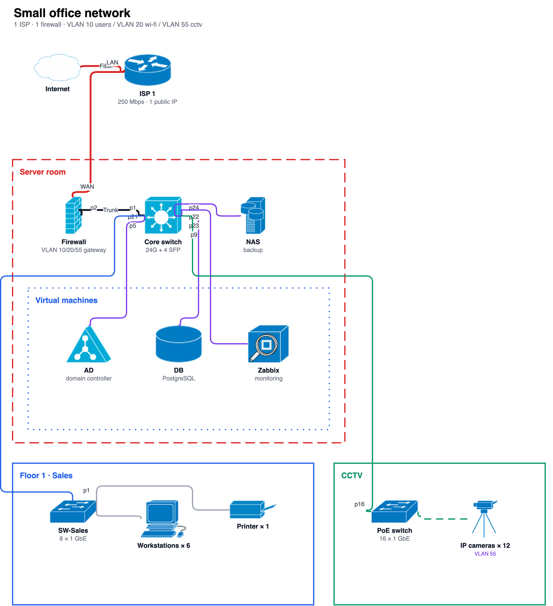
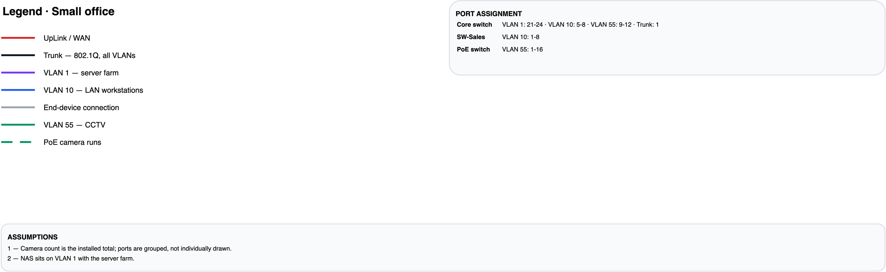

# topology-creator

A [Claude](https://claude.ai) skill that turns a described network into an
editable **draw.io** diagram — Cisco icons, zone boxes, interface labels on both
ends of every link, colour-coded VLANs, and a generated legend page.

You describe the network in chat. It writes `topology.drawio`. You open it in
draw.io and drag anything you don't like.



The legend page is built automatically from the links you actually used:



## Install

### Claude Code

```bash
git clone https://github.com/shkholikov/ithink-skills
cp -R ithink-skills/topology-creator ~/.claude/skills/
```

Restart Claude Code. Then just ask: *"draw our office network — 2 ISPs, a Kerio
firewall, an Aruba core switch, 4 floors…"*

### Claude Desktop / web / mobile

Grab `topology-creator-skill.zip` from
[Releases](https://github.com/shkholikov/ithink-skills/releases) and upload it at
**Settings → Capabilities → Skills**. No dependencies, so it runs unchanged in
Claude's sandbox.

## Optional: PNG and PDF export

The skill always produces `.drawio`. To also render images, install draw.io
Desktop:

```bash
brew install --cask drawio          # macOS
```

```bash
drawio -x -f png -s 2 -p 1 -o topology.png topology.drawio
drawio -x -f pdf --all-pages -o topology.pdf topology.drawio
```

Without it you still get the `.drawio` and can export via *File → Export as*.

## Using it directly

The skill is just a script — you can drive it without Claude:

```bash
python3 scripts/build_topology.py spec.json -o topology.drawio
```

See [`reference/spec-schema.md`](reference/spec-schema.md) for the format,
[`reference/examples/small-office.json`](reference/examples/small-office.json)
for a small worked spec, and [`examples/aslzar.json`](examples/aslzar.json) for a
real 53-node, 3-page enterprise network.

```json
{
  "pages": [{
    "name": "Floor 1",
    "nodes": ["internet", "isp1"],
    "zones": [{
      "id": "srv", "label": "Server room", "color": "#DC2626", "dash": "dashed",
      "nodes": ["fw", "core"]
    }]
  }],
  "nodes": [
    {"id": "fw", "icon": "firewall", "label": "Kerio Control", "sub": "VLAN 10 gateway"},
    {"id": "core", "icon": "l3-switch", "label": "Core switch", "sub": "24G + 4 SFP"}
  ],
  "links": [
    {"from": "fw", "to": "core", "fromPort": "p2", "toPort": "p1",
     "color": "#111827", "width": 3, "label": "Trunk",
     "meaning": "Trunk — 802.1Q, all VLANs"}
  ]
}
```

## How it works

- **Layout** is a zone grid: zones are boxes placed in rows, devices flow left to
  right inside them, nested zones stack underneath. Deterministic — the same spec
  always gives the same diagram.
- **Links are routed here, not by draw.io.** draw.io's router only knows the two
  endpoints, so on a dense diagram it draws straight through icons and captions.
  `routing.py` plans each path on a grid that knows where every icon, caption and
  zone header sits — A* with a turn penalty (paths stay straight) and a reuse
  penalty (parallel links take their own lane) — then emits explicit waypoints.
- **Icons are embedded** as base64 PNG, so a `.drawio` file is self-contained and
  opens anywhere with no missing assets.
- **Stdlib only.** No pip install, nothing to break in a sandbox.

## Icon names

Plain vocabulary resolves through `assets/aliases.json`:

`switch` · `l3-switch` · `poe-switch` · `firewall` · `ap` · `server` ·
`active-directory` · `database` · `nas` · `ip-camera` · `nvr` · `laptop` ·
`workstation` · `printer` · `patch-panel` · `ups` · `internet` · `isp-router`

All 294 icons are also addressable by their own slug — see `assets/icons.json`.
An unmatched name renders as a dashed placeholder box and prints a warning; it
never fails the build.

## Tests

```bash
python3 tests/test_build_topology.py
```

28 tests: the five hard-error cases, icon alias resolution, base64 embedding,
legend generation, obstacle avoidance in the router, and a clean build of the
shipped example.

## Regenerating the icons

`assets/icons/` is committed, so you don't need this. If you want to rebuild from
a fresh copy of the Cisco set:

```bash
pip install pillow
python3 tools/convert_icons.py "cisco icons" assets/icons
```

The converter flood-fills the background inward from the image border rather than
replacing white globally, so white *inside* an icon survives. It then trims,
upscales to 256px, and quantizes to a 64-colour palette — which cuts the asset
folder from 12 MB to 2.3 MB with no visible loss.

## Licence and attribution

The code is MIT licensed — see the [repository LICENSE](../LICENSE).

The network icons in `assets/icons/` are derived from the **Cisco Network
Topology Icon** library and remain the property of Cisco Systems, Inc. They are
included here for convenience and are **not** covered by the MIT licence. Cisco
provides them for use in documentation and presentations; refer to Cisco's own
terms for what you may do with them.
